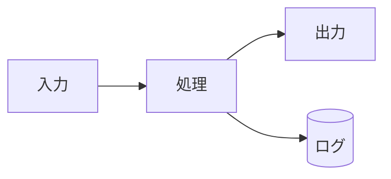

# データフロー図（記入テンプレ）

システム全体のデータフロー図。確定したら図を差し替える。

## 概要図

Mermaid や ASCII 図で「どこからどこへデータが流れるか」を描く。下記は例：

```
[入力装置] ──▶ [処理モジュール] ──▶ [出力装置]
                      │
                      ▼
                  [ログ保存]
```

Mermaid を使う場合：



## 主要なデータ構造

- プロジェクトで扱う主要なデータ構造を列挙する
- 例: 「センサ値フレーム（timestamp + 値 × N）」「状態通知メッセージ」など

## フェーズ・処理段階

1. **入力フェーズ**: 何がどこから入ってくるか
2. **処理フェーズ**: どう加工するか
3. **出力フェーズ**: どこへ出力するか

## 参考

通信の具体仕様は [protocol.md](protocol.md)（必要なら）に書く。
