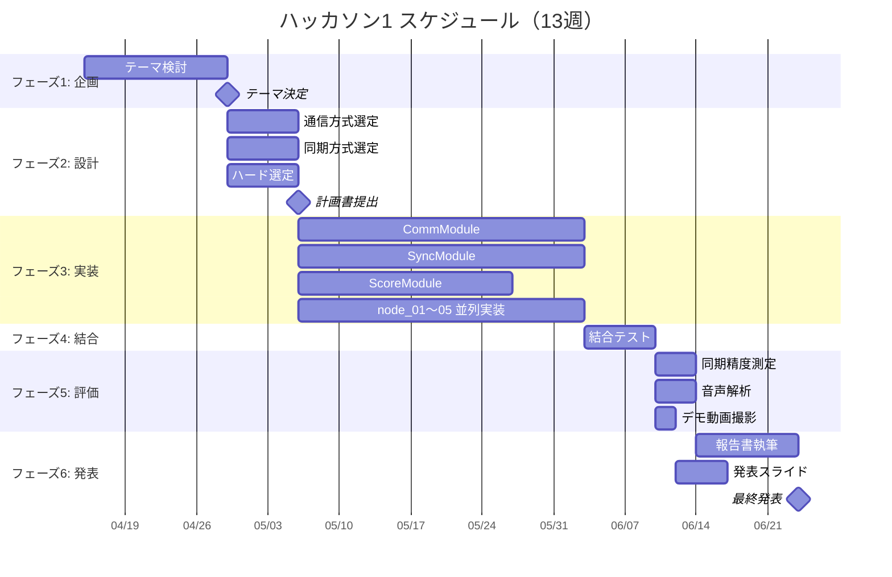

# ガントチャート

Mermaid で簡易ガント。13週分の大まかな進行。詳細タスクは [wbs.md](wbs.md) を参照。

## 全体スケジュール

```mermaid
gantt
    title ハッカソン1 スケジュール（13週）
    dateFormat  YYYY-MM-DD
    axisFormat  %m/%d

    section フェーズ1: 企画
    テーマ検討          :a1, 2026-04-15, 14d
    テーマ決定          :milestone, after a1, 0d

    section フェーズ2: 設計
    通信方式選定        :a2, after a1, 7d
    同期方式選定        :a3, after a1, 7d
    ハード選定          :a4, after a1, 7d
    計画書提出          :milestone, after a2, 0d

    section フェーズ3: 実装
    CommModule          :b1, after a2, 28d
    SyncModule          :b2, after a3, 28d
    ScoreModule         :b3, after a2, 21d
    node_01〜05 並列実装 :b4, after a4, 28d

    section フェーズ4: 結合
    結合テスト           :c1, after b4, 7d

    section フェーズ5: 評価
    同期精度測定         :d1, after c1, 4d
    音声解析             :d2, after c1, 4d
    デモ動画撮影         :d3, after c1, 2d

    section フェーズ6: 発表
    報告書執筆           :e1, after d1, 10d
    発表スライド         :e2, after d3, 5d
    最終発表             :milestone, after e1, 0d
```

## 備考

- 日付は暫定。実際の授業日程に合わせて調整する
- GitHub 上で表示する場合，Mermaid が自動レンダリングされる（Markdown プレビュー可）
