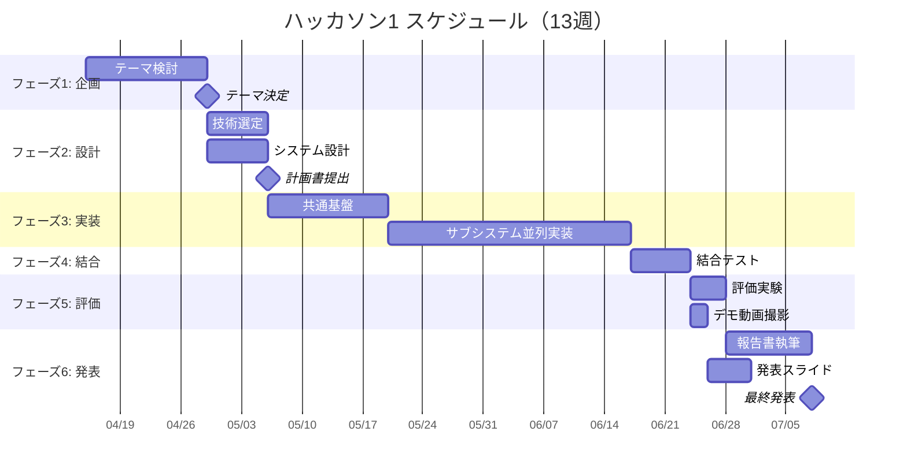

# ガントチャート（記入例）

Mermaid で 13週分のスケジュールを描く例。詳細なタスクは [wbs.md](wbs.md) を参照。

GitHub の Markdown プレビューは Mermaid を自動レンダリングする。

## 全体スケジュール（例）

## 備考

- 日付は暫定。実際の授業日程に合わせて調整する
- タスクは [wbs.md](wbs.md) と必ず対応させる
